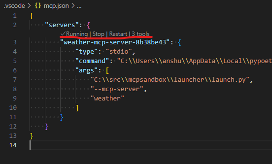
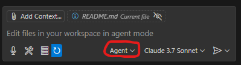
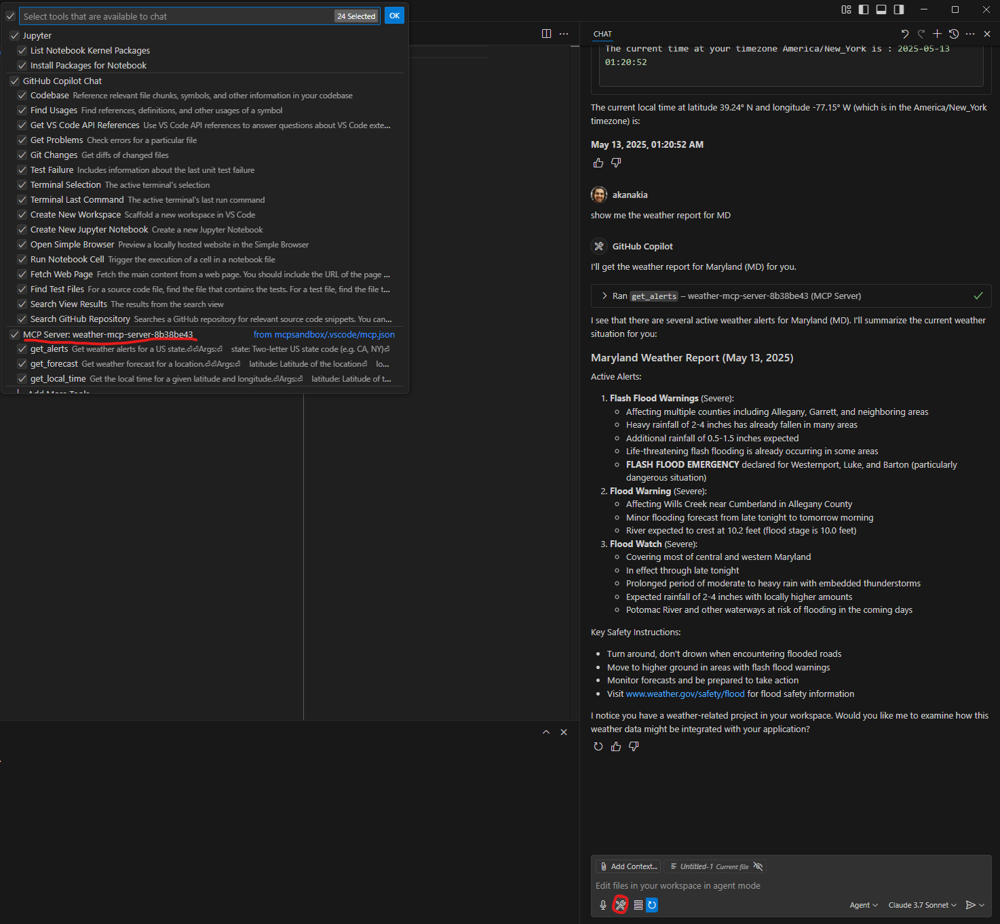
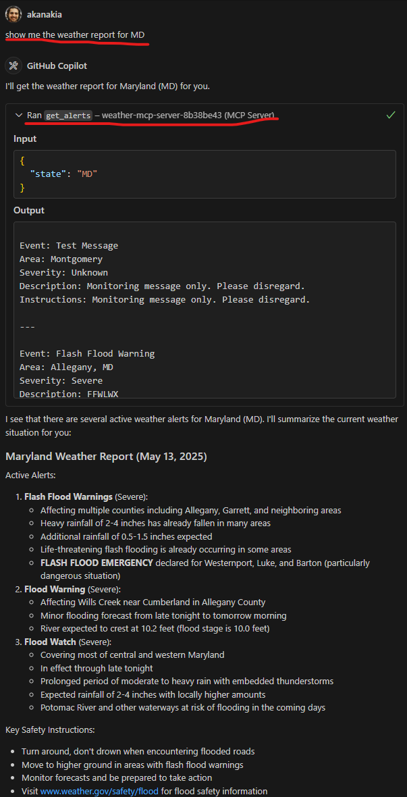

# MCP Sandbox

This repository contains boilerplate code and examples for creating Model context Protocol servers (MCP) in python,
using poetry as the package manager.

## Packages

This repository contains one package and one launch environment. The top-level package is namespaced within
`sandbox` and has the following layout:

```text
sandbox (namespace)
|
└ mcp (package)
   |
   └ servers
     |
     ├ spawner.py
     └ weather.py
```

The launch environment can be found in the [`/launcher`](launcher) folder. This environment can be used to launch MCP
servers and is typically the location that will be included in mcp client configurations
(like [VS Code](.vscode/mcp.json), or Claude Desktop).

## Minimum Requirements

* Python 3.10+
* Poetry 2.0+

## Setup

The `sanbox.mcp` package and launch environment are both managed using poetry, each with their own `pyproject.toml`
file. To install the package, run `poetry install` in the root directory of this repository. Similarly, to set up an
environment for the launch configuration, run `poetry install` within the `/launcher` folder. Note that the launch
environment is currently set up to install the `sandbox.mcp` package as a
[local, editable install](/launcher/pyproject.toml) to facilitate development and debugging. This setting can be
changed later to point to a production version of the package once it is deployed.

## Usage

The [`launch.py`](/launcher/launch.py) file illustrates how the `sandbox.mcp` package can be used. The recommended usage
pattern is to only load the server spawner factory using, `from sandbox.mcp.servers import MCPServerSpawner` and use
this factory object's `spawn_server()` method to return singleton instances of each `FastMCP` object. This ensures that
only a single instance of an MCP server is created, even if there are multiple calls for initialization.

The `spawn_server` method takes a server `name` is input and returns a `FastMCP` object. The server names are
automatically mapped to the name of the python .py file present in the `sandbox/mcp/servers/` folder which implements
the server. All .py files within the above folder must therefore contain a reference to a `FastMCP` object. See
[`weather.py`](sandbox/mcp/servers/weather.py), as an example.

## MCP client configuration

Different MCP clients each have their own server configuration format. It is typically a `.json` file containing the
launch information for one or more MCP servers. This repository contains a client configuration for VS Code's Github
Copilot, located [here](.vscode/mcp.json). When this repository is opened within an Copilot enables instance of VS Code,
the MCP servers will automatically be detected by the system and be enabled by default. For more information, please
refer to this link.

Once the MCP server has been detected and is running (as seen in screenshot below), it can be used within the Github
Copilot interactive window, which can be brought up using `ctrl/cmd + alt + I`.



The Github Copilot can now be switched to agent mode by selecting the "Agent" option from the input section dropdown to
the left of the LLM selector, as shown below.



To verify that the MCP server tools are available to the client, click the "tool" icon in the input section. This will
open a window with all the tools currently available to client - your server should be listed somewhere near the bottom
of the list.



The server is now successfully set up and related user queries will be routed to it from the MCP client LLM.


